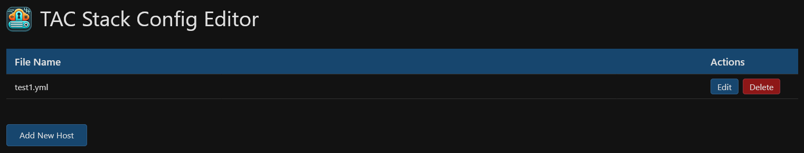
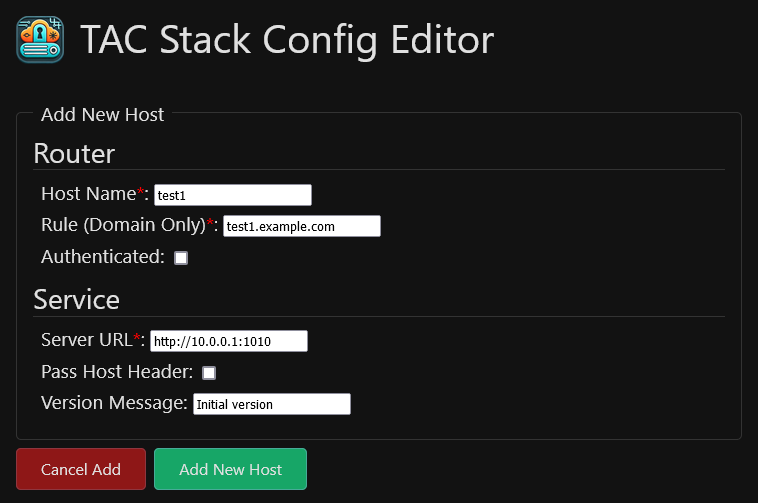

# TAC-Edit
TAC-Edit is a web-based editor for the dynamic configuration files of Traefik, the reverse proxy, in the TAC-Stack.  It also provides versioning of the config files, so you can roll back to previous versions (in development).

## Features
- Built using PHP and Apache
- Easy web-based CRUD operations on Traefik dynamic config files
- Versioning of file edits
- Rollback to previous versions (in development)

## Notes
- Currently, the basic features work.  There are some features that are still in development, such as the versioning system.  The versioning system is currently in place, but the rollback feature is not yet implemented.  The versioning system is a simple system that creates a new file with the current date and time as the filename, and copies the current config file to that new file.  The rollback feature will allow you to select a previous version and copy it back to the config file.  If you need to roll back, you can do so manually by copying the contents of the version file back to the config file.

## Screenshots
### Home page:


### Add page:


### Edit page:


## Installation
Use docker compose to pull the image and run the app.  Your compose file should look something like this:

```yaml
name: tac-edit

services:
  tac-edit:
    container_name: TAC-Edit
    restart: unless-stopped
    image: ghcr.io/solo-web-works/tac-edit:main
    user: 33:33 # Runs the container as the www-data user and group

    environment:
      # Sets the user and group for Apache inside the container
      - APACHE_RUN_USER=www-data
      - APACHE_RUN_GROUP=www-data

    ports:
      - "4040:80" # Maps port 80 in the container to port 4040 on the host. Change as needed.

    volumes:
      - /path/to/traefik/config:/data        # Required, mounts the Traefik config folder on the host to /data in the container
      - /path/to/tac-edit/logs:/logs         # Optional, mounts the logs folder in the container on the host
      - /path/to/tac-edit/versions:/versions # Optional, mounts the versions folder in the container on the host

    labels:
      - com.centurylinklabs.watchtower.enable=false # Optional, disables Watchtower if it's running on the host
```

