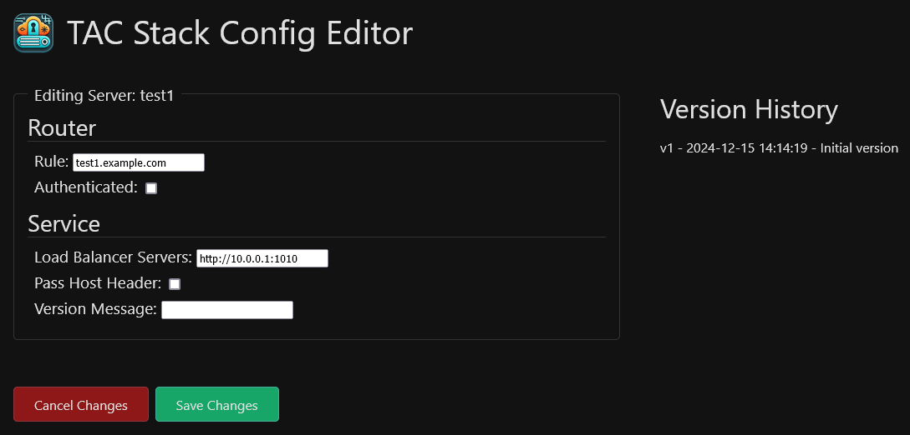

# TAC-Edit

Edit config files for TAC-Stack (Traefik-Authelia-Cloudflare) with ease.

Built using PHP and Apache, TAC-Edit allows you to easily edit the dynamic configuration files for Traefik, the reverse proxy, in the TAC-Stack.  It also provides versioning of the files, so you can roll back to previous versions (in development).

## Features
- Easy CRUD operations on Traefik dynamic config files
- Versioning of file edits
- Rollback to previous versions (in development)

## Screenshots

### Home page:


### Add page:


### Edit page:


## Installation
Use docker compose to pull the image and run the app.  Your compose file should look something like this:

```yaml
name: tac-edit

services:
  tac-edit:
    container_name: TAC-Edit
    restart: unless-stopped
    image: ghcr.io/solo-web-works/tac-edit:main
    user: 33:33 # Runs the container as the www-data user and group

    environment:
      # Sets the user and group for Apache inside the container
      - APACHE_RUN_USER=www-data
      - APACHE_RUN_GROUP=www-data

    ports:
      - "4040:80" # Maps port 80 in the container to port 4040 on the host. Change as needed.

    volumes:
      - /path/to/traefik/config:/data        # Required, mounts the Traefik config folder on the host to /data in the container
      - /path/to/tac-edit/logs:/logs         # Optional, mounts the logs folder in the container on the host
      - /path/to/tac-edit/versions:/versions # Optional, mounts the versions folder in the container on the host

    labels:
      - com.centurylinklabs.watchtower.enable=false # Optional, disables Watchtower if it's running on the host
```

